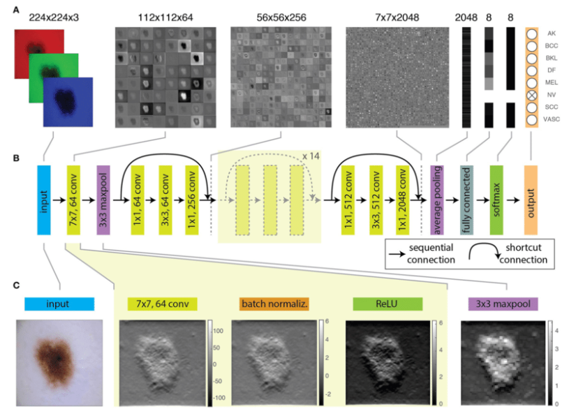

## XAI_CODS
Camouflaged Object Detection and Segmentation (COD/S) with Explainable AI 

### Dataset: 
  COD10K-TR[^1] consisting of 6K images (3040 concealed objects & 2960 non-concealed objects).
  Additional ranking information for COD10K-TR obtained from the CAM-FR[^3] dataset.
  Images are divided into 6 categories (Aquatic, Atmobios, Terrestrial, Amphibian, Other, and Background) and 78 sub-classes.
  
  Concealed Data Attributes     |  Concealed vs Category
  :------------------:|:---------------------------------:
   |  
 
 
### FACE-P1 High-Level Overview:
  Utilizing the SEDA[^2] architecture, Fing and Acquire Camouflage Explainability Phase 1 (FACE-P1) focuses on explaining the predictions of CODS.
  
 

The input image is of size CxHxW (Channel by Height by Width).

The Feature Extractor (ResNet50) is used to extract the unique features of the image and place them into the feature map (see example[^4] below).

_(A) Feature maps obtained at different layers of a trained ResNet-50, from the input RGB image, to the 8-element probability vector predicting the image class._

_(B) Schematic illustration of representative layers of the network._

_(C) Effect of convolution, batch normalization, activation ([Sigmoid](https://machinelearningmastery.com/a-gentle-introduction-to-sigmoid-function/#:~:text=Sigmoid%20As%20An%20Activation%20Function%20In%20Neural%20Networks,-The%20sigmoid%20function&text=A%20weighted%20sum%20of%20inputs,input%20to%20the%20next%20layer.&text=When%20the%20activation%20function%20for,be%20between%200%20and%201.)), and max-pooling on 1 of the 64 features producaed by the first convolutional layer from the input image._

The Sequence Interpreter module outputs a COL map (localization map) for segmentation which is a matrix of size HxW with a numeric value of 0 or 1 assigned to each matrix cell (aka pixel).

COL Table:

The Attention module outputs a COR map (ranking map) which is a matrix of size HxW with a numeric value assigned to each matrix cell (aka pixel).

COR Table:

The Decision Generator module takes the COL and COR maps to create the final COD/S image segmentation output and creates some underlying reasoning behind the decision-making process.

Decision Hierarchy Label Conditions for COD/S:

Decision Hierarchy Decisions and Messages:

*Layer 3 is highlighted. Stretch goal if object identification from feature maps for shadow, limb, eye, and mouth is doable.

### References:
[^1]: Deng-Ping Fan, Ge-Peng Ji, Guolei Sun, Ming-Ming Cheng, Jianbing Shen, Ling Shao. Concealed Object Detection. TPAMI, 2022.

[^2]: Alex Stringer, Brian Sun, Zackary Hoyt, Lacey Schley, Dean Hougen, and John K Antonio. Seda: A self-explaining decision architecture implemented using deep learning for on-board command and control. In 2021 IEEE/AIAA 40th Digital Avionics Systems Conference (DASC), pages 1–10. IEEE, 2021.

[^3]: Yunqiu Lv, Jing Zhang, Yuchao Dai, Aixuan Li, Bowen Liu, Nick Barnes, and Deng-Ping Fan. Simultaneously localize, segment and rank the camouflaged objects. In Proceedings of the IEEE/CVF Conference on Computer Vision and Pattern Recognition, pages 11591–11601, 2021.

[^4]: Cullell-Dalmau, Marta, et al. "Convolutional neural network for skin lesion classification: understanding the fundamentals through hands-on learning." Frontiers in Medicine 8 (2021): 644327.
