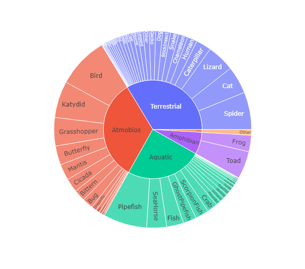
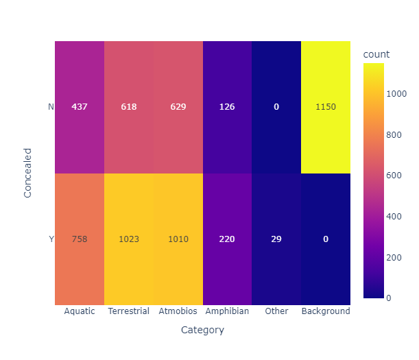
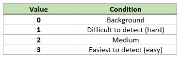
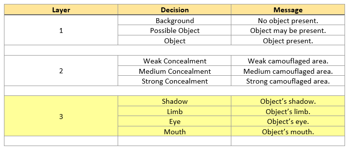

## XAI_CODS
Camouflaged Object Detection and Segmentation (COD/S) with Explainable AI 

### Dataset: 
  COD10K-TR[^1] consisting of 6K images (3040 concealed objects & 2960 non-concealed objects).
  Images are divied into 6 categories (Aquatic, Atmobios, Terrestrial, Amphibian, Other, and Background) and 78 sub-classes.
  
  Data Attributes     |  Concealed vs Category
  :------------------:|:---------------------------------:
   |  
 
 
### FACE-P1 High-Level Overview:
  Utilizing the SEDA[^2] architecture, Fing and Acquire Camouflage Explainability Phase 1 (FACE-P1) focuses on explaining the predictions of CODS.
  
 

The input image is of size CxHxW (Channel by Height by Width).

The Feature Extractor (ResNet50) is used to 

The Sequence Interpreter module outputs a COL map (localization map) for segmentation which is a matrix of size HxW with a numeric value of 0 or 1 assigned to each matrix cell (aka pixel).

COL Table:

The Attention module outputs a COR map (ranking map) which is a matrix of size HxW with a numeric value assigned to each matrix cell (aka pixel).

COR Table:

The Decision Generator module takes the COL and COR maps to create the final COD/S image segmentation output and creates some underlying reasoning behind the decision-making process.

Decision Hierarchy Label Conditions for COD/S:

Decision Hierarchy Decisions and Messages:

*Layer 3 is highlighted. Stretch goal if object identification from feature maps for shadow, limb, eye, and mouth is doable.

### References:
[^1]: Deng-Ping Fan, Ge-Peng Ji, Guolei Sun, Ming-Ming Cheng, Jianbing Shen, Ling Shao. Concealed Object Detection. TPAMI, 2022.

[^2]: Alex Stringer, Brian Sun, Zackary Hoyt, Lacey Schley, Dean Hougen, and John K Antonio. Seda: A self-explaining decision architecture implemented using deep learning for on-board command and control. In 2021 IEEE/AIAA 40th Digital Avionics Systems Conference (DASC), pages 1–10. IEEE, 2021.
