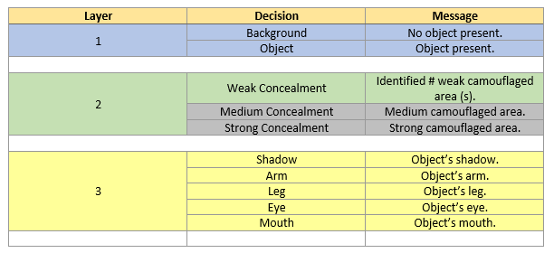

## XAI_CODS
Camouflaged Object Detection and Segmentation (COD/S) with Explainable AI 

### Dataset: 
  COD10K-TR[^1] consisting of 6K images (3040 concealed objects & 2960 non-concealed objects).
  Additional ranking information for COD10K-TR obtained from the CAM-FR[^3] dataset.
  Images are divided into 6 categories (Aquatic, Atmobios, Terrestrial, Amphibian, Other, and Background) and 78 sub-classes.
  
  Concealed Data Attributes     |  Concealed vs Category
  :------------------:|:---------------------------------:
   |  
 
 
### FACE-P1 High-Level Overview:
  Utilizing the SEDA[^2] architecture, Find and Acquire Camouflage Explainability Phase 1 (FACE-P1) focuses on explaining the predictions of CODS.
  
 

The input image is of size CxHxW (Channel by Height by Width).

The Feature Extractor ([ResNet50](https://datagen.tech/guides/computer-vision/resnet-50/)) is used to extract the unique features of the image and place them into the feature map.

The Sequence Interpreter module outputs a COL map (localization map) for segmentation which is a matrix of size HxW with a numeric value of 0 or 1 assigned to each matrix cell (aka pixel).

COL Table:

The Attention module outputs a COR map (ranking map) which is a matrix of size HxW with a numeric value assigned to each matrix cell (aka pixel).

COR Table:

The Decision Generator module takes the COL and COR maps to create the final COD/S image segmentation output and creates some underlying reasoning behind the decision-making process.

  Lvl 1 - Binary mask (COL) evaluation  - Is anything present?
  
  Lvl 2 - Ranking mask (COR) evaluation - Where is the weak camouflage located?
  
  Lvl 3 - Object Part Identification of weak camouflage - What part of the object breaks the camouflage concealment?

Decision Hierarchy Decisions and Messages:

* grayed out for later implementation

### References:
[^1]: Deng-Ping Fan, Ge-Peng Ji, Guolei Sun, Ming-Ming Cheng, Jianbing Shen, Ling Shao. Concealed Object Detection. TPAMI, 2022.

[^2]: Alex Stringer, Brian Sun, Zackary Hoyt, Lacey Schley, Dean Hougen, and John K Antonio. Seda: A self-explaining decision architecture implemented using deep learning for on-board command and control. In 2021 IEEE/AIAA 40th Digital Avionics Systems Conference (DASC), pages 1–10. IEEE, 2021.

[^3]: Yunqiu Lv, Jing Zhang, Yuchao Dai, Aixuan Li, Bowen Liu, Nick Barnes, and Deng-Ping Fan. Simultaneously localize, segment and rank the camouflaged objects. In Proceedings of the IEEE/CVF Conference on Computer Vision and Pattern Recognition, pages 11591–11601, 2021.

[^4]: Cullell-Dalmau, Marta, et al. "Convolutional neural network for skin lesion classification: understanding the fundamentals through hands-on learning." Frontiers in Medicine 8 (2021): 644327.

[^5]: Wang, Tianyu, et al. "Instance shadow detection." Proceedings of the IEEE/CVF Conference on Computer Vision and Pattern Recognition. 2020.

[^6]: Morabia, Keval, Jatin Arora, and Tara Vijaykumar. "Attention-based joint detection of object and semantic part." arXiv preprint arXiv:2007.02419 (2020).

[^7]: He, Ju, et al. "Partimagenet: A large, high-quality dataset of parts." Computer Vision–ECCV 2022: 17th European Conference, Tel Aviv, Israel, October 23–27, 2022, Proceedings, Part VIII. Cham: Springer Nature Switzerland, 2022.
