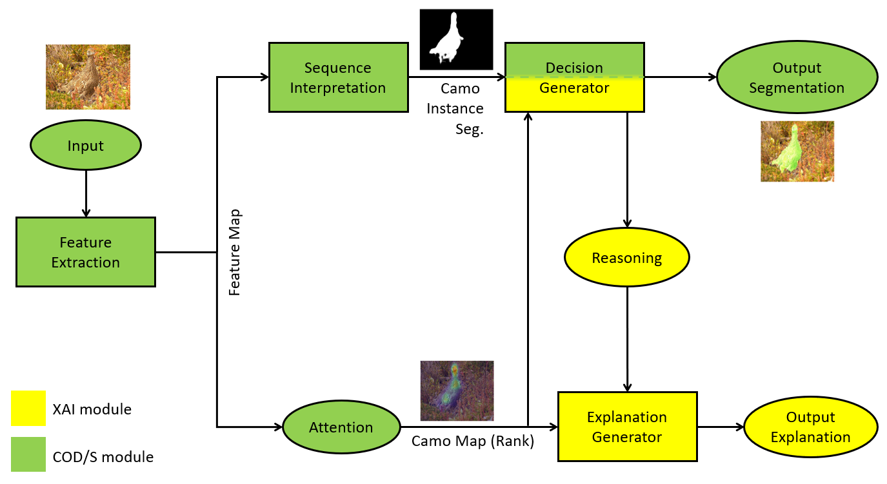

## XAI_CODS
Camouflaged Object Detection and Segmentation with Explainable AI 

### Dataset: 
  COD10K-TR consisting of 6K images (3040 concealed objects & 2960 non-concealed objects)
  Images are divied into 10 categories and 78 sub-classes.
  
  
  
  Citation:
  Deng-Ping Fan, Ge-Peng Ji, Guolei Sun, Ming-Ming Cheng, Jianbing Shen, Ling Shao. Concealed Object Detection. TPAMI, 2022.
  
  
### FACE-P1 High-Level Overview:
 
